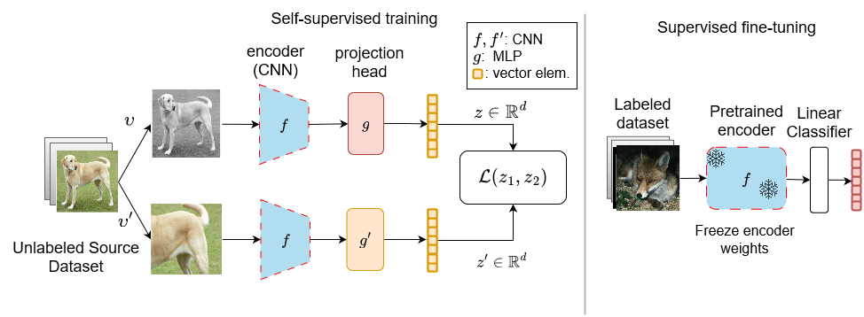
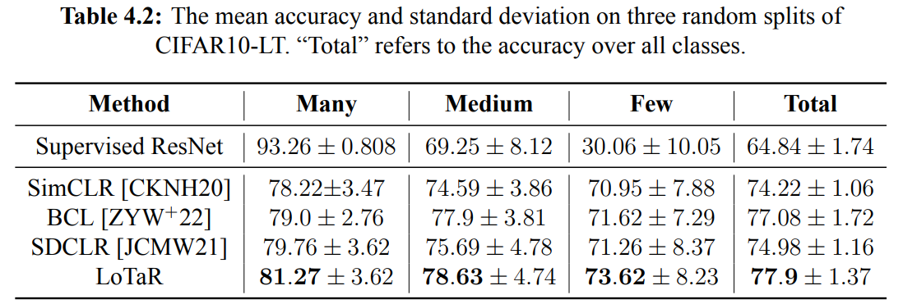
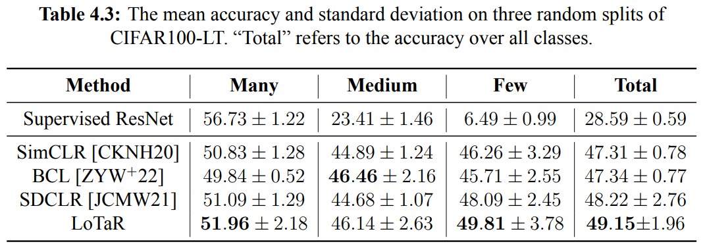

# Self-Supervised Learning on Long-Tailed Data

## Objective
The objective of this repository is to train and evaluate various self-supervised learning (SSL) methods on long-tailed/imbalanced data.
This is code used for my master's thesis (LoTaR below).

SSL is usually implemented in two stages:



1. **Representation Learning**: Train an encoder on a large, unlabeled dataset using the desired self-supervised algorithm.
2. **Fine-tuning**: Test the quality of the encoder's representations by fine-tuning the classifier using *supervised* learning (i.e. w/ the labels).

In this project, we use [SimCLR](https://arxiv.org/abs/2002.05709) as the base model in all the experiments. Also included is the code for Boosted Contrastive Learning [(BCL)](https://arxiv.org/abs/2205.12693) and Self-Damaging Contrastive Learning [(SDCLR)](https://arxiv.org/abs/2106.02990).

## Training
The file `train.py` contains the code necessary for training the base SimCLR model and LoTaR, the proposed approach in my thesis. The file will make a sub-directory in the `./runs` directory and will store the model as it trains. 

The script `./run.sh` is set up to directly run the training script.

### Training Splits
CIFAR10/CIFAR100 are balanced datasets out-of-the-box, so previous papers sample several long-tailed subsets of samples (called splits) from these datasets and train the model on each individual split. To avoid any side-effects of the random sampling, three splits are created, where the ordering of the classes is randomized in each split so a class will have different amounts of samples in each split.

We created three splits and are stored in the `spltis` folder.

### Imbalance Ratio
The imbalance ratio indicates how long-tailed the dataset is. It is the ratio of the number of samples of the class  to the sample number of the class with the least samples.

$$\rho=\frac{\max(n_i)}{\min(n_j)},\quad i,j\in\{1,\dots,C\}$$
where $n_{\{i,j\}}$ are the number of samples in classes $i$ and $j$, respectively.
An imbalance ratio of 100 in this experiment means the largest class has 100x the samples of the smallest class (this is the default).

## Evaluating
The `train_lincls.py` file takes the pre-trained model, and fine-tunes a single linear classification layer on top of the learned representations using the full, balanced CIFAR10/CIFAR100 training dataset. It freezes all the other layers, meaning it *only* trains the final fully-connected layer.

It then evaluates the model on the balanced test set.
Here you also have to indicate which split the model was trained on so we can get the sample distribution for that split and calculate the accuracies on head/tail classes.
The result will be saved as `results.txt` in the same folder where the model was saved.

### Results
Architecture | Encoder Output Dim. | Projector Otput Dim | Training Epochs | Acc.
---|---|---|---|---|
resnet18 | 512 | 128 | 100 | 79.838

When testing on three splits of long-tailed CIFAR10 and CIFAR100, called CIFAR10-LT, and CIFAR100-LT, the results are as follows.
For each split class indices ${1,\dots,C}$ are randomly shuffled and samples are chosen from the $i$-th class using an exponential distribution, leading to a long-tailed subset of the original dataset.
Each model is then trained and evaluated on the same split, and this process is repeated three times.
Below, we report the mean accuracies across splits and the standard deviation per category.
"Many", "Medium", "Few" refer to the mean accuracies (and stdev) on the third of the classes with most,medium, and least training samples, respectively.
The categories serve to indicate head/tail classes, and how performance changes as the amount of training samples per class decreases.





### SimCLR citation
```bibtex
@article{chen2020simple,
  title={A Simple Framework for Contrastive Learning of Visual Representations},
  author={Chen, Ting and Kornblith, Simon and Norouzi, Mohammad and Hinton, Geoffrey},
  journal={arXiv preprint arXiv:2002.05709},
  year={2020}
}
```
